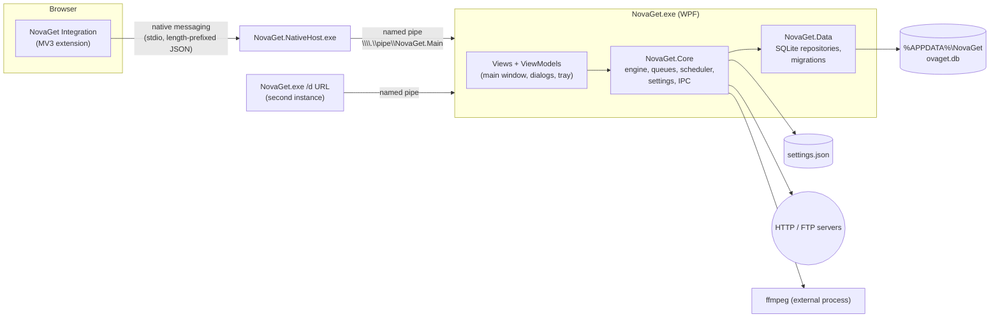

# NovaGet

NovaGet is a free, native Windows download manager. Its layout and workflow follow the classic
multi-connection download managers that long-time Windows users already know: a category tree on the
left, the download list on the right, a big toolbar, per-download progress dialogs, queues with a
scheduler, and browser integration that catches downloads and videos.

- Windows 10 1809+ and Windows 11, x64 (ARM64 optional)
- C# 12 / .NET 8, WPF (MVVM), SQLite, Serilog
- No ads, no telemetry. The only network traffic is your downloads and an optional update check you can turn off.

> **Status:** under active development, milestone by milestone (see [Roadmap](#roadmap)).

## Features

| Area | What you get |
|---|---|
| Engine | Multi-connection dynamic segmentation (1–32 connections), connection reuse, crash-safe resume, auto-retry with backoff, global + per-download speed limits |
| Protocols | HTTP, HTTPS, FTP, FTPS, HLS (`.m3u8`) and DASH (`.mpd`) with ffmpeg merging. DRM-protected streams are detected and refused. |
| Organization | Categories with per-category folders, queues, a scheduler (daily/one-time, wake from sleep), a synchronization queue |
| Browser | Manifest V3 extension for Chrome, Edge, Brave, Opera, Vivaldi and Firefox: download capture, "Download with NovaGet" menus, "Download all links", video download panel |
| Extras | Site grabber, batch downloads with wildcards, clipboard monitor, drop target, EF2/text import and export, IDM-compatible command line |
| Network | System/manual/PAC proxies, SOCKS 4/4a/5, site logins, Basic/Digest/NTLM/Negotiate authentication, download quotas, dial-up/VPN hang-up |
| Polish | English and Arabic (right-to-left), light/dark themes, per-monitor DPI, keyboard navigation, antivirus hook, Mark-of-the-Web, checksums |

## Building

Requirements: .NET 8 SDK, PowerShell 7, and [Inno Setup 6](https://jrsoftware.org/isinfo.php) for the installer.

```powershell
./build.ps1                 # test, publish, package -> dist\NovaGet-Setup-<version>.exe
./build.ps1 -SkipInstaller  # everything except the Inno Setup step
dotnet test                 # tests only (UI smoke tests run on Windows only)
```

The version lives in one place, `Directory.Build.props`, and flows into every assembly, the About box and the installer.
Set `CERT_PFX` and `CERT_PASS` to sign the installer.

Core, Data and the test suite are cross-platform; the WPF app also compiles on Linux/macOS
(`EnableWindowsTargeting`), but only runs on Windows. CI (`.github/workflows/build.yml`) builds on
`windows-latest`, runs the tests, uploads the installer, and publishes a GitHub release for `v*` tags.

## Architecture



| Project | Role |
|---|---|
| `src/NovaGet.Core` | Download engine, models, settings, IPC (pipe + native messaging framing), command-line parsing. No UI; cross-platform so it can be tested anywhere. |
| `src/NovaGet.Data` | SQLite persistence (Microsoft.Data.Sqlite + Dapper), schema migrations with `schema_version`, DPAPI-protected secrets. |
| `src/NovaGet.App` | WPF shell (`NovaGet.exe`): single instance, tray, windows and dialogs, composition root. |
| `src/NovaGet.NativeHost` | Native messaging host: relays browser messages to the running app, starting it if needed. |
| `browser-extension/` | Chromium and Firefox MV3 extensions. |
| `installer/` | Inno Setup script and native-host manifest templates. |
| `tests/` | xUnit tests (engine, data, settings, IPC), Windows-only WPF smoke tests, and a local HTTP test server. |

Files on disk: settings and the database live in `%APPDATA%\NovaGet`, temp files and logs in
`%LOCALAPPDATA%\NovaGet`. With a `portable.flag` file next to `NovaGet.exe`, everything goes to `.\Data`.

## Roadmap

| # | Milestone | Status |
|---|---|---|
| 1 | Skeleton: solution, DI, logging, settings, SQLite + migrations, single instance + pipe, CI installer | Done |
| 2 | Engine v1: probe, single connection, pause/resume, temp → final move | Done |
| 3 | Engine v2: dynamic segmentation, reuse, retries, crash-safe resume, speed limiter | Done |
| 4 | Main window, toolbar, categories, virtualized list, tray | Done |
| 5 | Download dialogs | Done |
| 6 | Options dialog | Done |
| 7 | Queues and scheduler | Done |
| 8 | FTP/FTPS, proxies, logins, quotas, dial-up | Done |
| 9 | Browser integration | Done |
| 10 | Video and streams | Done |
| 11 | Batch, import/export, command line | Planned |
| 12 | Site grabber | Planned |
| 13 | Polish: icons, sounds, localization, themes, accessibility | Planned |
| 14 | Installer final | Planned |
| 15 | QA pass, v1.0.0 | Planned |

Design decisions are recorded in [DECISIONS.md](DECISIONS.md); the command line is documented in
[docs/command-line.md](docs/command-line.md).

## License

MIT, see [LICENSE](LICENSE). Third-party components are listed in [THIRD_PARTY_NOTICES.txt](THIRD_PARTY_NOTICES.txt).
